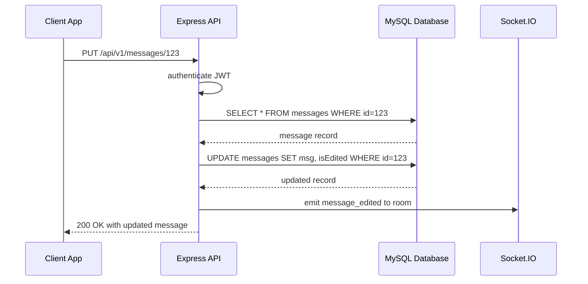

# Messages API – Edit an Existing Message 📝

This endpoint allows a user to update the **content** and **attachments** of a previously sent chat message. It ensures only the original sender or an admin can perform the edit, preserving chat integrity and user permissions.

## Authentication

All requests to this endpoint require a valid **JWT token** in the `Authorization` header.

- The token is verified via the `authenticate` middleware.
- Only the message’s **original sender** or a user with **admin** privileges may edit a message.

## Path Parameters

| Parameter | Type | Description |
| --- | --- | --- |
| **id** | string | The unique identifier of the message to edit. |


## Request Body

Content Type: **application/json**

| Field | Type | Required | Description |
| --- | --- | --- | --- |
| **content** | string | yes | The updated text of the message. |
| **attachments** | array of objects | no | List of attachment objects (e.g., images, files). |


**Attachment Object**

| Field | Type | Description |
| --- | --- | --- |
| **url** | string | Location of the attachment. |
| **type** | string | MIME type (e.g., image/png). |


```card
{
    "title": "Edit Restrictions",
    "content": "Only the original sender or an admin may edit a message. Consider adding a time window for edits."
}
```

## Sequence Flow



## Success Response

> **Note:** Currently, there is no time-based restriction on editing messages. Consider implementing an edit window (e.g., within 15 minutes) as a best practice.

Status: **200 OK**

Content-Type: application/json

```json
{
  "status": "success",
  "data": {
    "id": "123",
    "chat_group_id": "abc-room",
    "sender": 45,
    "senderName": "jane.doe@example.com",
    "msg": "Here’s the revised content!",
    "attachments": [
      {
        "url": "https://cdn.example.com/image.png",
        "type": "image/png"
      }
    ],
    "isEdited": true,
    "isDeleted": false,
    "hidefrom": [],
    "readList": [],
    "sentAt": "2024-06-15T12:34:56.000Z"
  }
}
```

## Error Responses

| HTTP Code | Error Type | Description |
| --- | --- | --- |
| 400 | ValidationError | Missing or invalid `content`. |
| 401 | Unauthorized | No token provided or token invalid. |
| 403 | Forbidden | User is neither the original sender nor an admin. |
| 404 | NotFound | Message with given `id` does not exist. |
| 500 | ServerError | Unexpected server error while updating the message. |


## Example Request

```bash
curl -X PUT https://api.example.com/api/v1/messages/123 \
  -H "Authorization: Bearer <your_jwt_token>" \
  -H "Content-Type: application/json" \
  -d '{
    "content": "Updated message content",
    "attachments": [
      {
        "url": "https://cdn.example.com/newfile.pdf",
        "type": "application/pdf"
      }
    ]
  }'
```

## Implementation Context

- The real-time edit logic lives in the Socket.IO handler, where a message record is updated and broadcast via `message_edited` .
- A RESTful controller (`messages.controller.js`) would mirror this by calling `Message.findByPk(id)`, verifying `req.user.id` against `message.sender`, updating `msg` and `isEdited`, then returning the updated record.
- The `authenticate` middleware applied in `server.js` ensures JWT validation for all `/api/v1/messages` endpoints .

---

By adhering to this documentation, client developers can confidently integrate message-editing features, maintaining secure and consistent chat behavior across web and mobile applications.